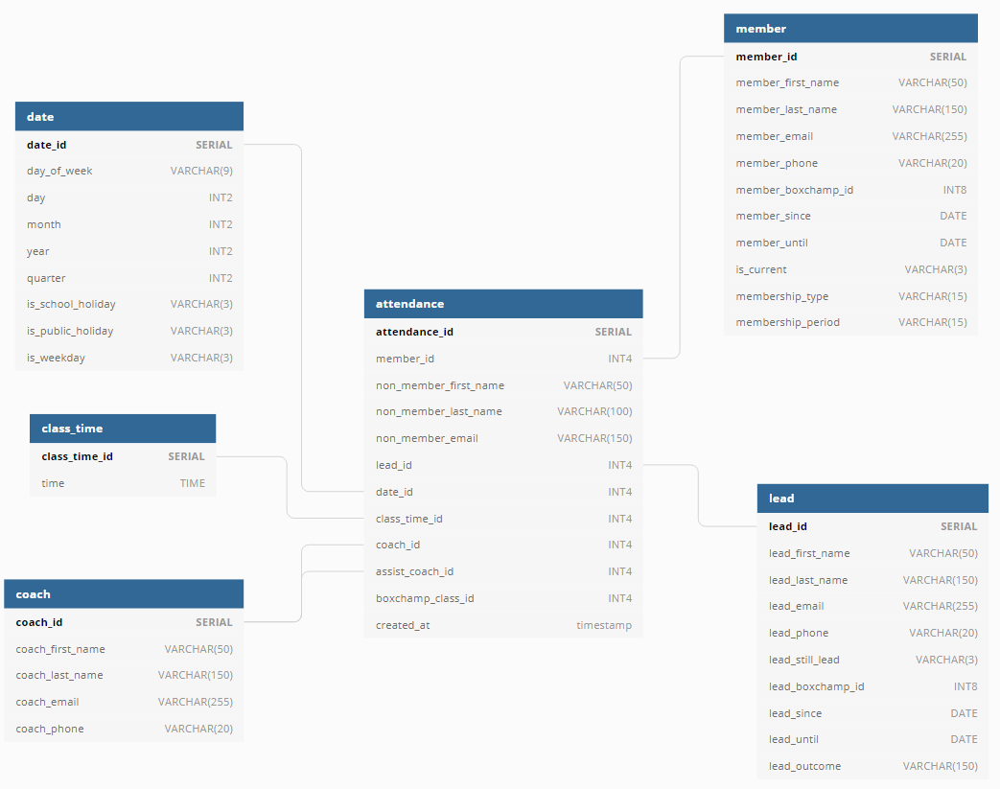
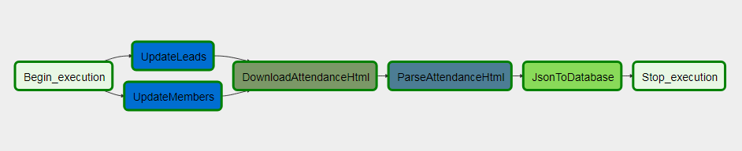

## Overview
The purpose of this project was to create a database of the attendance of members of a fitness facility. Attendance was captured on a 3rd party app called BoxChamp, however this application did not have the analytics requirements needed. So a Postgres database was created on AWS to store the daily attendance records. 

The system needed to be updated daily. Not only the attendance records, but also the change of membership status. Leads to active members, active members to inactive members and potentially back to active members. 

A star schema was created to store the data based on the following diagram:

This would allow extensive analytics on the data.

The Airflow DAG that was set up would run daily as follows:

1. Begin_execution - A Dummy Operator to begin the DAG
2. a) UpdateLeads - Synchronises the database with the 3rd party app. Adds new leads and updates leads that have been converted.
2. b) UpdateMembers - Synchronises the database with the 3rd party app. Adds new members and updates members that have been activated and deactivated.
3. DownloadAttendanceHtml - Downloads an html file with the attendance records for the day prior to execution date
4. ParseAttendanceHtml - Parses the downloaded html files and saves them as json files for smaller file storage
5. JsonToDatabase - Loads the data to the Postgres website hosted on AWS
6. Stop_execution = A Dummy Operator to complete the DAG

## Quickstart

### A. Configuration & database setup
1. Rename 'db_template.cfg' to 'db.cfg' and fill in the database credentials
2. Rename 'airflow/setup_template.cfg' to 'airflow/setup.cfg' and fill in the HOME directory and login credentials for BoxChamp
3. Run 'db_setup.py' to create all necessary tables in database

### B. Dependencies
#### Follow the below setup on an AWS AMI/Centos/Redhat AWS EC2 instance or operating system

##### Run updates
$ `sudo yum update`

#### Download & install Anaconda
$ `curl -O https://repo.anaconda.com/archive/Anaconda3-2020.02-Linux-x86_64.sh` 
$ `bash Anaconda3-2020.02-Linux-x86_64.sh` 
$ `rm Anaconda3-2020.02-Linux-x86_64.sh` 

#### Activate anaconda environment
$ `source ~/.bashrc` 

#### Install dependencies for Google Chrome (required for webscraping)
$ `curl https://intoli.com/install-google-chrome.sh | bash`

#### Install Chromedriver (required for webscraping)
$ `wget -N https://chromedriver.storage.googleapis.com/2.35/chromedriver_linux64.zip -P ~/` 
$ `unzip ~/chromedriver_linux64.zip -d ~/` 
$ `rm ~/chromedriver_linux64.zip` 
$ `sudo mv -f ~/chromedriver /usr/local/bin/chromedriver` 
$ `sudo chown root:root /usr/local/bin/chromedriver` 
$ `sudo chmod 0755 /usr/local/bin/chromedriver` 

#### Install Selenium (required for webscraping)
$ `pip install selenium` 

#### Install development tools (needed for airflow)
$ `sudo yum -y install gcc gcc-c++` 

#### Set home for Apache-Airflow
$ `export AIRFLOW_HOME=~/airflow` 

#### Install Apache-Airflow (https://airflow.apache.org/docs/stable/start.html)
$ `pip install apache-airflow` 
$ `airflow initdb`

#### Airflow files/folders
Copy the files inside the Airflow/ folder in this repository into your Airflow folder on your machine

### C. Run Airflow and DAGs
#### Start Airflow
$ `airflow scheduler -D` 
$ `airflow webserver -D`

If you are hosting this locally, you can access the Airflow Webserver UI at localhost:8080.

If you are hosting this on a cloud hosted machine access the Airflow UI via _'machine-ip-address'_:8080.

There are 2 dags, _attendance_ and _attendance2_. 
- _attendance_ runs without updating members & leads (good if you want to backfill the attendance)
- _attendance2_ runs first by updating members & leads (best to keep the member & lead data fresh and updated)

### D. Additional information
The folder _temp/_ contains example files that are downloaded as html and then parsed to json files. 